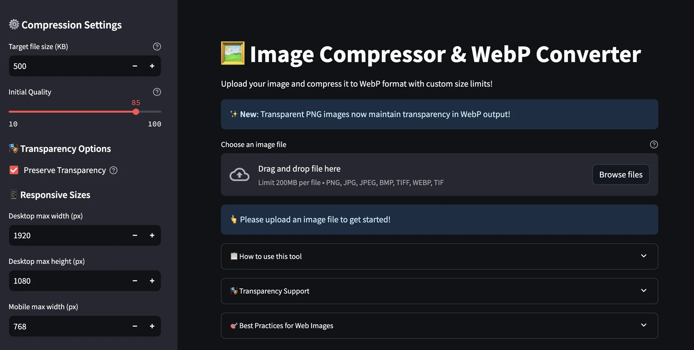
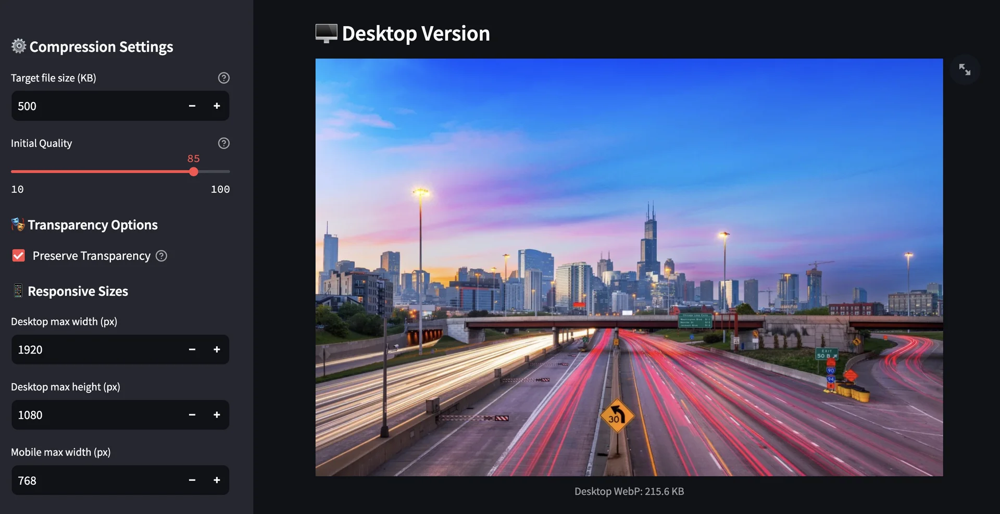
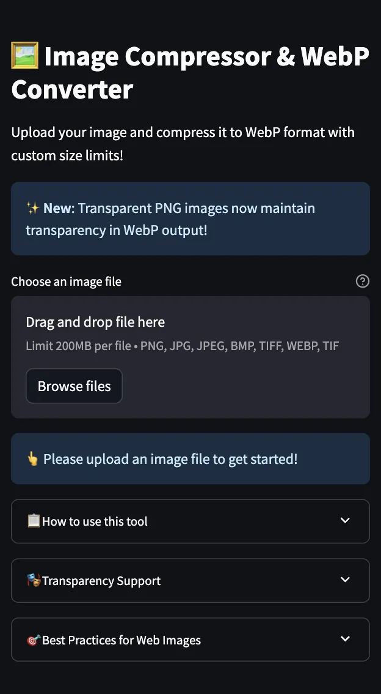

# 🖼️ Image Compressor & WebP Converter

[](https://www.python.org/)
[](https://streamlit.io/)
[](LICENSE)
[](https://github.com/dhruvpandyadp/Image-Compressor-WebP-Converter)

A powerful and user-friendly web application for compressing images and converting them to WebP format with automatic size optimization for both desktop and mobile devices.

[](https://fastwebp.streamlit.app/)

## ✨ Key Features

- 🖼️ **Multi-format Support** - PNG, JPG, JPEG, BMP, TIFF, WebP
- 📱 **Responsive Optimization** - Desktop and mobile versions
- 🎭 **Perfect Transparency** - Maintains PNG transparency in WebP
- 🔧 **Smart Compression** - Binary search algorithm for optimal quality
- 📊 **Real-time Stats** - Live compression ratios and file sizes
- 🚀 **Easy to Use** - Intuitive web interface
- ⚡ **Fast Processing** - Efficient image optimization
- 🌐 **Cross-platform** - Works on Windows, Mac, Linux

## 🚀 Quick Start

### Prerequisites
- Python 3.7 or higher
- pip package manager

### Installation

1. **Clone the repository:**
   ```bash
   git clone https://github.com/dhruvpandyadp/Image-Compressor-WebP-Converter.git
   ```

2. **Install dependencies:**
   ```bash
   cd Image-Compressor-WebP-Converter
   ```

   ```bash
   pip install -r requirements.txt
   ```

4. **Run the application:**
   ```bash
   streamlit run app.py
   ```

5. **Open your browser** and go to `http://localhost:8501`

## 💻 Usage

1. **Upload** your image using the file uploader
2. **Configure** compression settings in the sidebar:
   - Target file size (10KB - 5MB)
   - Quality settings (10-100%)
   - Transparency options
   - Responsive dimensions
3. **Click** "🚀 Compress Image" to process
4. **Download** both desktop and mobile optimized versions

## 📊 Performance

| Original Format | Original Size | WebP Size | Reduction |
|----------------|---------------|-----------|-----------|
| PNG (with transparency) | 850 KB | 180 KB | **79%** |
| JPEG (high quality) | 420 KB | 280 KB | **33%** |
| PNG (without transparency) | 600 KB | 120 KB | **80%** |

## 🛠️ Technical Details

### Built With
- **[Streamlit](https://streamlit.io/)** - Web app framework
- **[Pillow (PIL)](https://pillow.readthedocs.io/)** - Image processing
- **Python 3.7+** - Programming language

### Algorithm
- Binary search optimization for precise file size targeting
- Intelligent transparency preservation
- Responsive image generation with aspect ratio maintenance
- Automatic format conversion with quality optimization

## 🔧 Configuration

### Compression Settings
- **Target File Size**: 10 KB - 5 MB
- **Initial Quality**: 10-100% (auto-optimized)
- **Transparency**: Preserve or replace with a custom background

### Responsive Dimensions
- **Desktop**: Up to 1920×1080px (configurable)
- **Mobile**: Up to 768px width (configurable)

## 📱 Browser Support

| Browser | Support |
|---------|---------|
| Chrome | ✅ Full Support |
| Firefox | ✅ Full Support |
| Safari | ✅ Full Support |
| Edge | ✅ Full Support |
| Mobile Browsers | ✅ Full Support |


## 📝 License

This project is licensed under the MIT License - see the [LICENSE](LICENSE) file for details.

## 👨‍💻 Author

**Dhruv Pandya**

- GitHub: [@dhruvpandyadp](https://github.com/dhruvpandyadp)
- LinkedIn: [Dhruv Pandya](https://linkedin.com/in/dhruvpandyadp)

## 🙏 Acknowledgments

- Thanks to the Streamlit team for the amazing framework
- Pillow library contributors for excellent image processing capabilities
- WebP format developers for superior compression technology

## 📸 Screenshots

### Main Interface


### Compression Results


### Mobile Interface


---

⭐ **If you found this project helpful, please give it a star!** ⭐

[](https://github.com/dhruvpandyadp/Image-Compressor-WebP-Converter)
